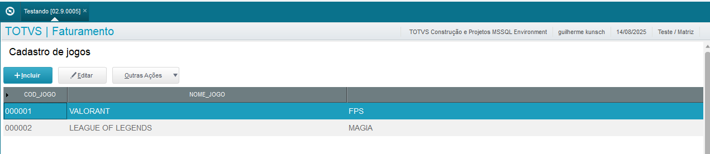
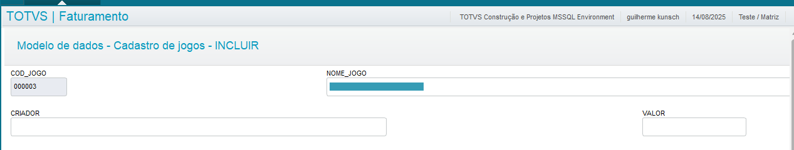

# 📋 Cadastro de Jogos

Este projeto implementa uma tela de **Cadastro de Jogos** desenvolvida em **ADVPL**, utilizando o **Modelo 01** 

## 🛠 Tecnologias utilizadas
- **ADVPL** (linguagem do Protheus)
- **Padrão MVC** da TOTVS
- **SmartClient** para execução da rotina

## 📸 Captura de tela

## Funcionalidades
- Menu utilizando o módulo SIGAFAT
- O usuário pode visualizar, incluir, editar e criar novos registros

